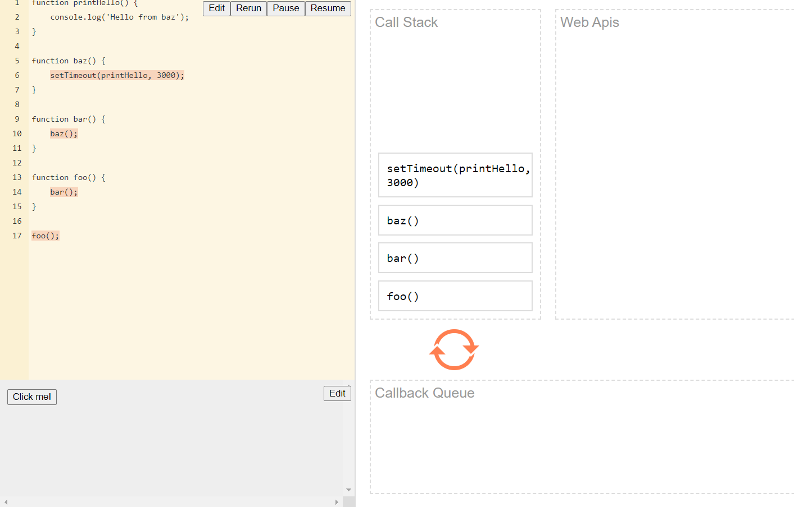
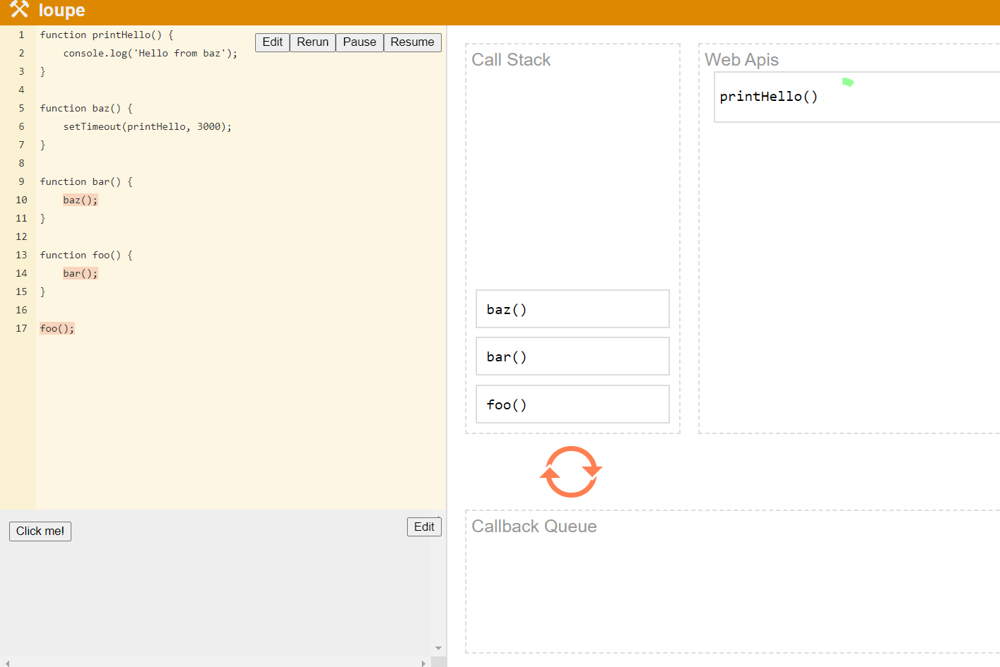
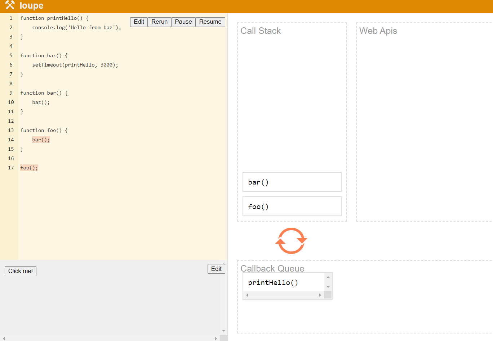
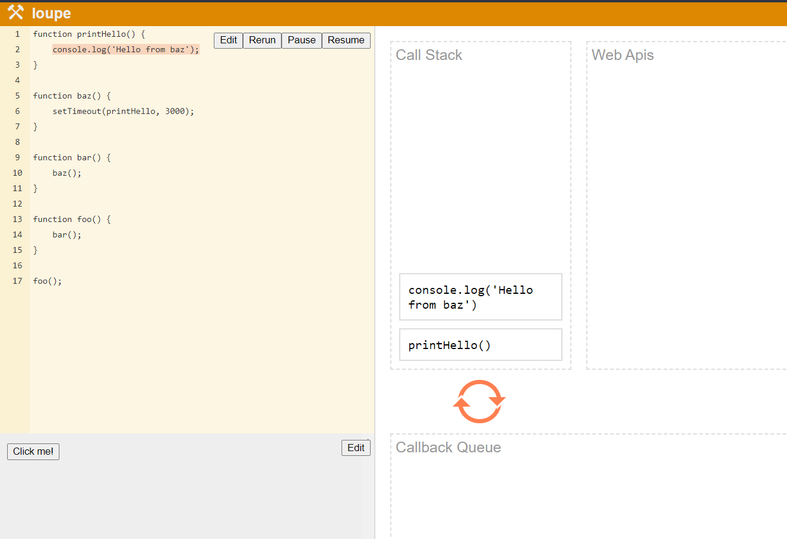

# Web API:
 ####  Inbuilt  API used to perform asynchronous operations. which use DOM,fetch(), setTimeout() to perform such operation. 
 #### Browser Provides us with Fetch and setTimeout through `window` 

## Fetch

 ####  Set of functions/opeations which uses Memory heap to perfrom operations
 ####  Stores only functions which are pushed into it.
 
 
## 3.setTimeout

 ####  This happens when maximum call stack size exceeds (eg:Recursion).
 
## Execution

 #### Whenever we run any code which has asynchronous nature its operation get passed from call stack to WEB API then to Callback Queue from there Eventloop continuously checks  for Call stack to get empty then it pushes the asynchronous operation back to Call Stack for Execution.

###  [Try it out](http://latentflip.com/loupe/?code=ZnVuY3Rpb24gcHJpbnRIZWxsbygpIHsNCiAgICBjb25zb2xlLmxvZygnSGVsbG8gZnJvbSBiYXonKTsNCn0NCg0KZnVuY3Rpb24gYmF6KCkgew0KICAgIHNldFRpbWVvdXQocHJpbnRIZWxsbywgMzAwMCk7DQp9DQoNCmZ1bmN0aW9uIGJhcigpIHsNCiAgICBiYXooKTsNCn0NCg0KZnVuY3Rpb24gZm9vKCkgew0KICAgIGJhcigpOw0KfQ0KDQpmb28oKTs%3D!!!PGJ1dHRvbj5DbGljayBtZSE8L2J1dHRvbj4%3D)
`const number= 420.69`  

 
 
 
   ####                                                                         Call Stack call

 
 
   ####                                                                        Call Stack call
 
 
  
  
  
  
   ####                                                                        Call Stack call
  
   
   
   
   
   ####                                                                        Call Stack call

